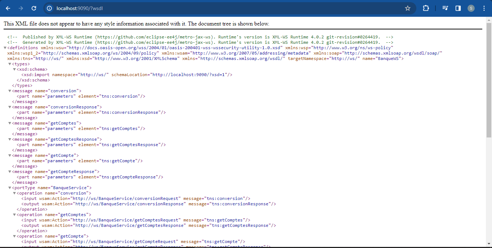
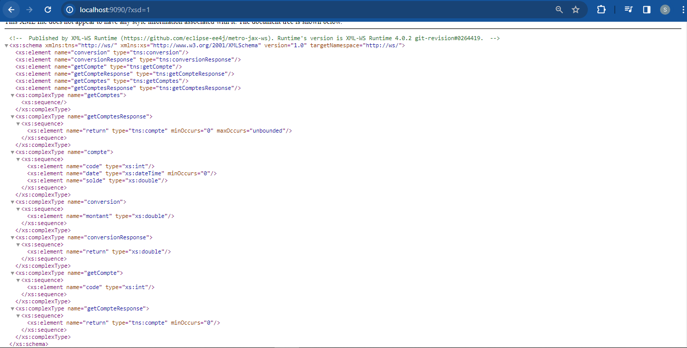
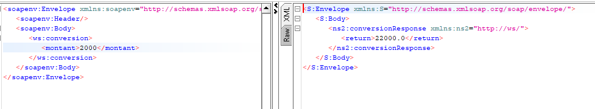
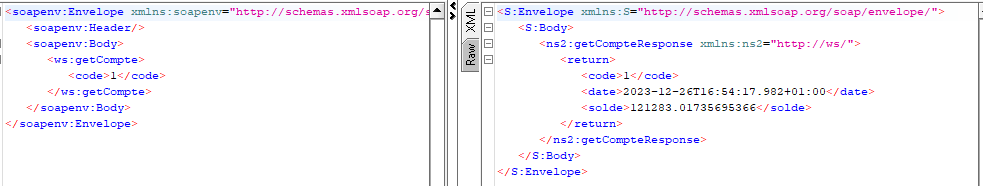
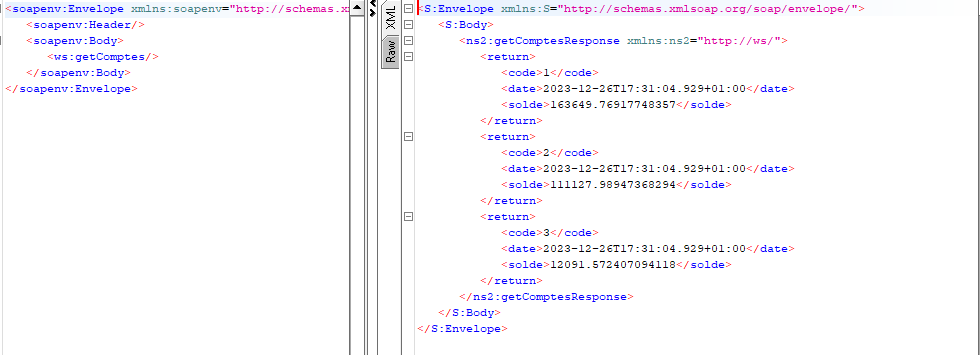

<h3>SOAP WebService Application</h3> 
Cette application est développée en utilisant Java avec JAX-WS (Java API for XML Web Services) pour implémenter un service web SOAP.

<h4>WSDL<h4>
 

<h4>XSD<h4>
 

<h4>SoapUI Request and Response (méthode: conversion)<h4>
 

<h4>SoapUI Request and Response (méthode: getCompte)<h4>
 

<h4>SoapUI Request and Response (méthode: getComptes)<h4>
 